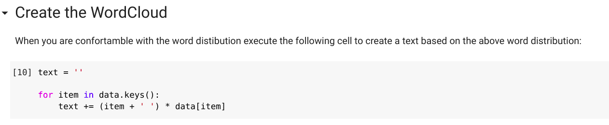

# Wordcloud

This notebook create Wordcloud for a bunch of words.

This notebook will create a text including the words you want to include in the wordcloud. Each word will appear as many times as you want, from 1 to 100.

Word size in the wordcloud will depend on the word frequency within the created text.

## Usage

Include the words you want to appear in the workcloud in the python list **words**:

Execute the cell to create the slides bars and set the weight for each word:

Execute the cell to create the graphs to check word frequency to verify if that meets what you want. Remember higher frequency higher size in the wordcloud:

Modify slide bar word value and create the frequency charts up to you get the distribution you want.

When you have a word distribution which you are confortable with generate the text that will be used to create the word cloud:

To create a wordcloud configure the size of the image file with **width** and **height**. After executing the cell the file with the image will be saved in the filesystem:

You can also can generate a wordcloud using a shape:

You will need to use a **8-bit/color RGBA** image using two colors as [ansible-mask.png](ansible-mask.png). Configure **shape** variable with the path to the mask you want to use and execute the cell.

The wordcloud within the shape will be stored in the filesystem.

## Using google colab

You can run the notebook using Google Colab. If using Google Colab to upload the mask or download the generated wordcloud you can do using the upload/download files feature:

